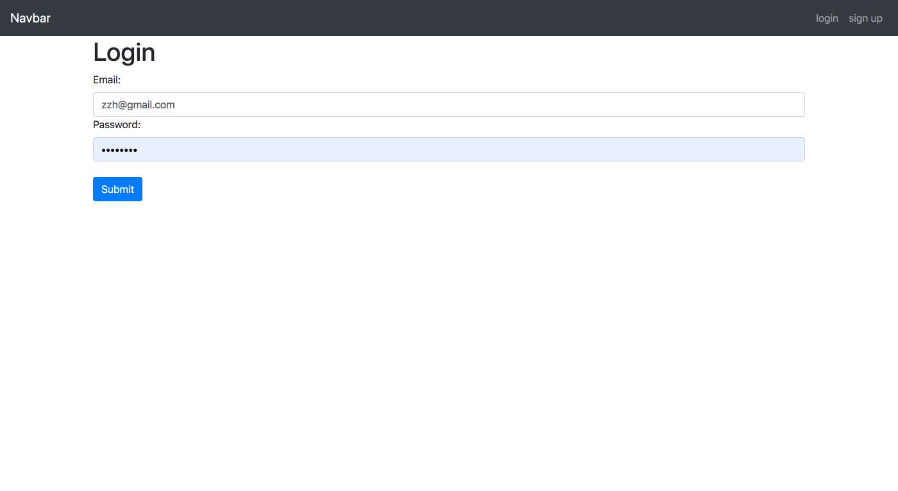
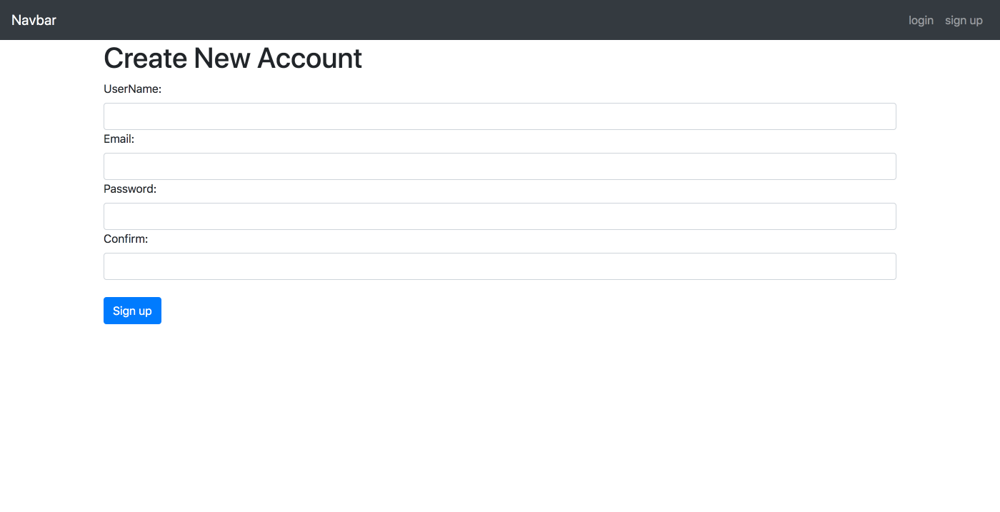
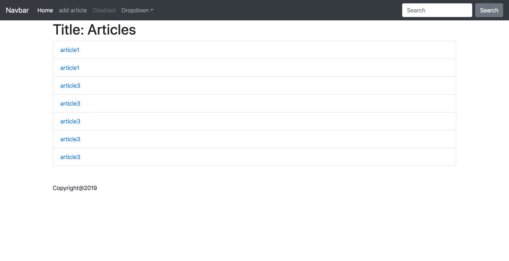
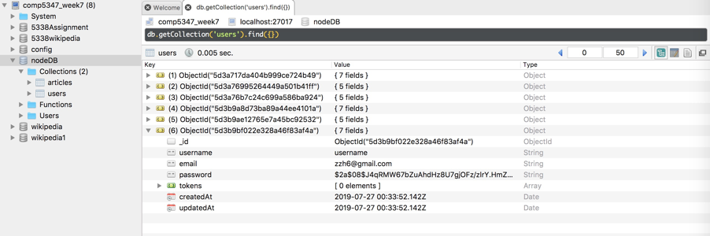
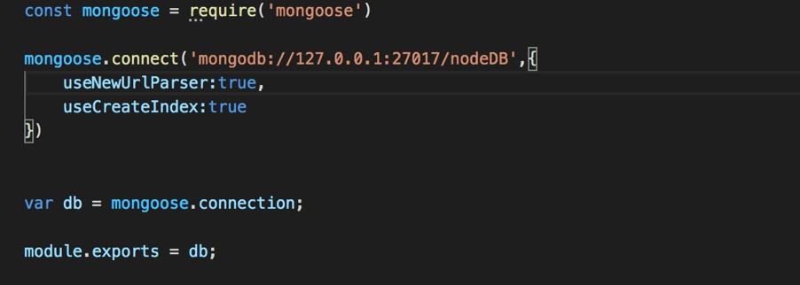

**Online notes App**  
This is a simple online notes app, you can registed an account and login.  
write the notes. (uncompleted project)  

node.js + express.js + pug(view engine) + MongoDB + bootstrap  
  
middleware: auth  (Bearer token)

In development, a local database is used(Robo 3t) to store the data. When the project finished, I'll use the remote database MongoDB (Atlas).  

The screenshot of preject:  

**Todo:**  
allow user to add image.  
registed with google account.   
  
**How to start the programe.**  
nodemon app.js  